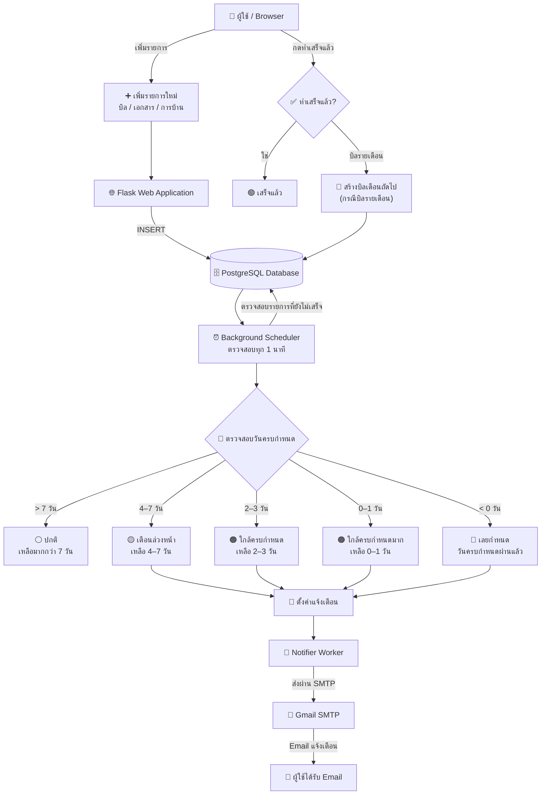

# 💌 Document / Bill Due Reminder

ระบบแจ้งเตือนบิล/เอกสารที่ต้องส่ง-ชำระก่อนวันครบกำหนด ผู้ใช้บันทึกรายการ
(บิล, เอกสาร, การบ้าน/งาน) พร้อมวันครบกำหนด ระบบจะเช็คอัตโนมัติแล้วจัดระดับ
ความเร่งด่วนให้เอง พร้อมแจ้งเตือนบน dashboard ทันทีที่รายการใกล้ครบกำหนดหรือเลยกำหนดแล้ว

---

## 📐 System Diagram

---

## 🧱 สถาปัตยกรรม

| Component | รายละเอียด |
|---|---|
| **web** | Flask app (เขียน Dockerfile เอง) ทำหน้าที่ 1) รับบันทึกรายการบิล/เอกสารใหม่ 2) รัน background job เช็ควันครบกำหนดอัตโนมัติ 3) แสดง dashboard พร้อมแจ้งเตือน |
| **notifier** | Python worker แยกต่างหาก (เขียน Dockerfile เอง) ไม่มี web server ทำหน้าที่เช็คฐานข้อมูลเป็นระยะแล้วส่งอีเมลแจ้งเตือนจริงเมื่อมีรายการใกล้/เลยกำหนด |
| **db** | PostgreSQL (official image) เก็บข้อมูลรายการทั้งหมด (`items`) พร้อมระดับความเร่งด่วน |

### กลไกการจัดระดับความเร่งด่วน (แจ้งเตือนหลายระดับ)
| ระดับ | เงื่อนไข | สี |
|---|---|---|
| ปกติ | เหลือมากกว่า 7 วัน | เทา |
| เตือนล่วงหน้า | เหลือ 4–7 วัน | เหลือง |
| ใกล้ครบกำหนด | เหลือ 2–3 วัน | ส้มอ่อน |
| ใกล้ครบกำหนดมาก | เหลือ 0–1 วัน | ส้มเข้ม |
| เลยกำหนดแล้ว | เลยวันครบกำหนด (น้อยกว่า 0 วัน) | แดง |
| เสร็จแล้ว | ผู้ใช้กดทำเครื่องหมายเสร็จ | เขียว |

Background Scheduler จะตรวจสอบรายการที่ยังไม่เสร็จเป็นระยะ
โดยเปรียบเทียบวันปัจจุบันกับวันครบกำหนด (`due_date`) เพื่อคำนวณ
ระดับความเร่งด่วนของแต่ละรายการ

### 🔁 บิลรายเดือนอัตโนมัติ (เหมาะกับค่าไฟ/ค่าน้ำ)
เวลาเพิ่มรายการ สามารถติ๊ก "บิลรายเดือน" ได้ (เหมาะกับบิลที่มาซ้ำทุกเดือน เช่น ค่าไฟ ค่าน้ำ ค่าเน็ต)
เมื่อกด "ทำเสร็จแล้ว" (จ่ายแล้ว) ระบบจะสร้างรายการของ**เดือนถัดไปให้อัตโนมัติ**
(due date +1 เดือน จัดการวันที่ปลายเดือนให้ถูกต้อง เช่น 31 ม.ค. -> 28/29 ก.พ.)
ไม่ต้องมาเพิ่มรายการเดิมซ้ำทุกเดือน

---

## 🔮 แนวทางต่อยอด

- เพิ่มระบบ login เพื่อให้แต่ละคนมีรายการของตัวเอง
- เพิ่ม container Redis เก็บ cache รายการที่เข้าดูบ่อย
- เปลี่ยนจากอีเมลเป็น LINE Messaging API (ผ่าน LINE Official Account) แทน SMTP

---

## 👤 ผู้จัดทำ

ชื่อ-นามสกุล: นายนัสรี ม่องพร้า  
รหัสนักศึกษา: 166404140070 
สาขาวิศวกรรมคอมพิวเตอร์  
มหาวิทยาลัยเทคโนโลยีราชมงคลศรีวิชัย

