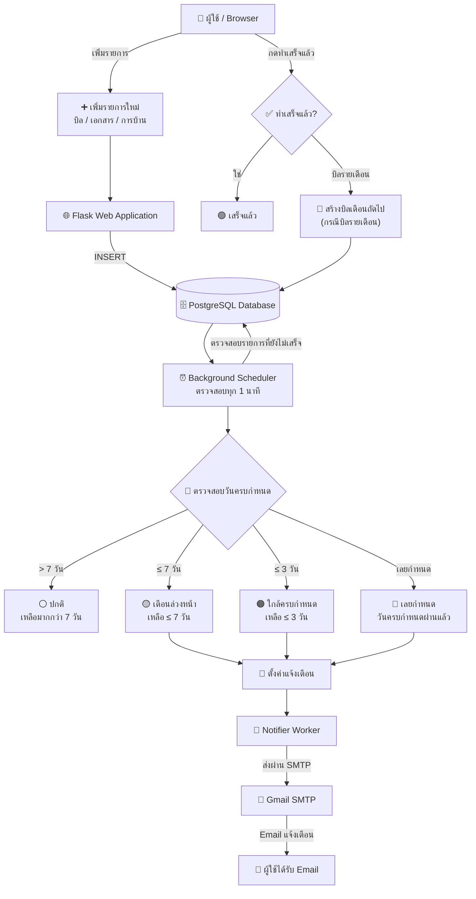

# 💌 Document / Bill Due Reminder

ระบบแจ้งเตือนบิล/เอกสารที่ต้องส่ง-ชำระก่อนวันครบกำหนด ผู้ใช้บันทึกรายการ
(บิล, เอกสาร, การบ้าน/งาน) พร้อมวันครบกำหนด ระบบจะเช็คอัตโนมัติแล้วจัดระดับ
ความเร่งด่วนให้เอง พร้อมแจ้งเตือนบน dashboard ทันทีที่รายการใกล้ครบกำหนดหรือเลยกำหนดแล้ว

---

## 📐 System Diagram



---

## 🧱 สถาปัตยกรรม

| Component | รายละเอียด |
|---|---|
| **web** | Flask app (เขียน Dockerfile เอง) ทำหน้าที่ 1) รับบันทึกรายการบิล/เอกสารใหม่ 2) รัน background job เช็ควันครบกำหนดอัตโนมัติ 3) แสดง dashboard พร้อมแจ้งเตือน |
| **notifier** | Python worker แยกต่างหาก (เขียน Dockerfile เอง) ไม่มี web server ทำหน้าที่เช็คฐานข้อมูลเป็นระยะแล้วส่งอีเมลแจ้งเตือนจริงเมื่อมีรายการใกล้/เลยกำหนด |
| **db** | PostgreSQL (official image) เก็บข้อมูลรายการทั้งหมด (`items`) พร้อมระดับความเร่งด่วน |

รวม **3 containers** (เกินเกณฑ์ขั้นต่ำ 2 containers) และมี **custom Dockerfile 2 ไฟล์** (`app/Dockerfile`, `notifier/Dockerfile`) ทำงานร่วมกันผ่าน Docker Compose network เดียวกัน

### ทำไมถึงเลือกส่งแจ้งเตือนผ่านอีเมลแทน LINE Notify
เดิมทีตั้งใจจะส่งแจ้งเตือนผ่าน LINE Notify แต่บริการนี้ **ปิดให้บริการอย่างเป็นทางการไปแล้วตั้งแต่วันที่ 31 มีนาคม 2025**
จึงเปลี่ยนมาใช้การส่งอีเมลผ่าน SMTP แทน ซึ่งใช้งานได้จริง ไม่มีค่าใช้จ่าย และตั้งค่าง่ายกว่า

### กลไกการจัดระดับความเร่งด่วน (แจ้งเตือนหลายระดับ)
| ระดับ | เงื่อนไข | สี |
|---|---|---|
| ปกติ | เหลือมากกว่า 7 วัน | เทา |
| เตือนล่วงหน้า (≤7 วัน) | เหลือ ≤ 7 วัน | เหลือง |
| ใกล้ครบกำหนด (≤3 วัน) | เหลือ ≤ 3 วัน | ส้มอ่อน |
| ใกล้ครบกำหนดมาก (≤1 วัน) | เหลือ ≤ 1 วัน | ส้มเข้ม |
| เลยกำหนดแล้ว | เลยวันครบกำหนดมาแล้ว | แดง |
| เสร็จแล้ว | ผู้ใช้กดทำเครื่องหมายเสร็จ | เขียว |

Background scheduler เช็คทุกรายการที่ยังไม่เสร็จ เทียบวันปัจจุบันกับวันครบกำหนด ทุกครั้งที่ระดับ
เปลี่ยนขั้น (เช่น "เตือนล่วงหน้า" → "ใกล้ครบกำหนด") จะตั้ง flag แจ้งเตือนใหม่ให้ทันที ทำให้ผู้ใช้
ได้รับอีเมลแจ้งเตือนสูงสุดถึง 3 ครั้งต่อ 1 รายการ ก่อนถึงวันครบกำหนดจริง
(ระดับการแจ้งเตือนปรับได้ผ่าน environment variable `REMINDER_THRESHOLDS` เช่น `"7,3,1"`)

### 🔁 บิลรายเดือนอัตโนมัติ (เหมาะกับค่าไฟ/ค่าน้ำ)
เวลาเพิ่มรายการ สามารถติ๊ก "บิลรายเดือน" ได้ (เหมาะกับบิลที่มาซ้ำทุกเดือน เช่น ค่าไฟ ค่าน้ำ ค่าเน็ต)
เมื่อกด "ทำเสร็จแล้ว" (จ่ายแล้ว) ระบบจะสร้างรายการของ**เดือนถัดไปให้อัตโนมัติ**
(due date +1 เดือน จัดการวันที่ปลายเดือนให้ถูกต้อง เช่น 31 ม.ค. -> 28/29 ก.พ.)
ไม่ต้องมาเพิ่มรายการเดิมซ้ำทุกเดือน

---

## 🚀 วิธีรันโปรเจค

```bash
git clone <your-repo-url>
cd bill-reminder
docker compose up --build
```

จากนั้นเปิดเบราว์เซอร์ไปที่ **http://localhost:5000**

### วิธีทดสอบ
1. เพิ่มรายการใหม่ เช่น "ค่าเทอม" พร้อมกำหนดวันครบกำหนดเป็นวันพรุ่งนี้ (จะขึ้นสีส้ม "ใกล้ครบกำหนด" ทันที)
2. ลองเพิ่มอีกรายการที่วันครบกำหนดเป็นเมื่อวาน (จะขึ้นสีแดง "เลยกำหนดแล้ว")
3. กด "✓ ทำเสร็จแล้ว" เพื่อปิดรายการที่จัดการเรียบร้อยแล้ว
4. กด "🔄 เช็คสถานะล่าสุดตอนนี้" เพื่อสั่งให้ระบบคำนวณระดับความเร่งด่วนใหม่ทันที (ไม่ต้องรอ 1 นาที)

## 📧 วิธีตั้งค่าให้ส่งอีเมลแจ้งเตือนได้จริง

`notifier` ต้องใช้ **Gmail App Password** (ไม่ใช่รหัสผ่าน Gmail จริง เพื่อความปลอดภัย)

1. เปิด 2-Step Verification ที่บัญชี Gmail ก่อน (ถ้ายังไม่เปิด) ที่ https://myaccount.google.com/security
2. ไปที่ https://myaccount.google.com/apppasswords แล้วสร้าง App Password ใหม่ (เลือกประเภท "Mail")
3. คัดลอกรหัส 16 หลักที่ได้ ไปใส่ในไฟล์ `docker-compose.yml` แทนที่:
   ```yaml
   - SMTP_USER=your_email@gmail.com
   - SMTP_PASSWORD=your_16_digit_app_password
   - NOTIFY_TO_EMAIL=your_email@gmail.com
   ```
4. รัน `docker compose up --build` ใหม่

> ถ้ายังไม่ตั้งค่า SMTP_USER/SMTP_PASSWORD ระบบจะไม่ error แต่จะพิมพ์เนื้อหาอีเมลลง log แทน
> (ดูได้ด้วย `docker logs reminder_notifier`) เพื่อให้เห็นว่า logic การทำงานถูกต้อง แม้ยังไม่ได้ต่ออีเมลจริง

### วิธีทดสอบว่า notifier ทำงาน
```bash
docker logs -f reminder_notifier
```
เพิ่มรายการที่วันครบกำหนดเป็นวันนี้หรือเมื่อวานผ่านหน้าเว็บ รอไม่เกิน 1 นาที (หรือกด "เช็คสถานะล่าสุดตอนนี้"
บนหน้าเว็บก่อน แล้วรอ notifier รอบถัดไป) จะเห็น log แสดงว่ากำลังส่งอีเมล หรือถ้าต่ออีเมลจริงไว้
จะได้รับอีเมลแจ้งเตือนเข้ากล่องจดหมาย

---

## 📁 โครงสร้างโปรเจค

```
bill-reminder/
├── README.md
├── docker-compose.yml
├── app/
│   ├── Dockerfile
│   ├── requirements.txt
│   ├── main.py
│   └── templates/
│       └── index.html
└── notifier/
    ├── Dockerfile
    ├── requirements.txt
    └── notifier.py
```

---

## ⚙️ Environment Variables

| ตัวแปร | ค่าเริ่มต้น | คำอธิบาย |
|---|---|---|
| `REMINDER_THRESHOLDS` | 7,3,1 | จำนวนวันก่อนครบกำหนดที่จะแจ้งเตือนแต่ละระดับ (คั่นด้วย comma) |
| `DB_HOST` / `DB_NAME` / `DB_USER` / `DB_PASSWORD` | - | การเชื่อมต่อฐานข้อมูล (ใช้ร่วมกันทั้ง web และ notifier) |
| `SMTP_HOST` / `SMTP_PORT` | smtp.gmail.com / 587 | เซิร์ฟเวอร์ที่ใช้ส่งอีเมล |
| `SMTP_USER` / `SMTP_PASSWORD` | - | อีเมลผู้ส่งและ App Password (ดูวิธีตั้งค่าด้านบน) |
| `NOTIFY_TO_EMAIL` | เท่ากับ SMTP_USER | อีเมลปลายทางที่จะได้รับแจ้งเตือน |
| `CHECK_INTERVAL_SECONDS` | 60 | ความถี่ที่ notifier เช็คฐานข้อมูล (วินาที) |

---

## 🔮 แนวทางต่อยอด (ถ้าอยากพัฒนาเพิ่ม)

- เพิ่มระบบ login เพื่อให้แต่ละคนมีรายการของตัวเอง
- เพิ่ม container Redis เก็บ cache รายการที่เข้าดูบ่อย
- เปลี่ยนจากอีเมลเป็น LINE Messaging API (ผ่าน LINE Official Account) แทน SMTP

---

## 👤 ผู้จัดทำ

ชื่อ-นามสกุล / รหัสนักศึกษา: _(กรอกของตัวเอง)_
